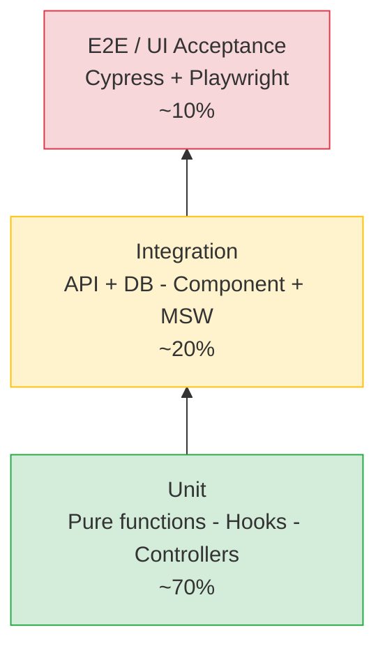

# Forever — A QA Engineering Showcase

> An end-to-end quality assurance strategy applied to a real-world MERN e-commerce application. This repository is a portfolio piece demonstrating how a QA Engineer designs, automates, and operates testing across the full stack — backend APIs, frontend UI, and everything in between.

[](https://forever-frontend-hazel.vercel.app/)


---

## Why this repository exists

This project is **not** primarily about shipping an e-commerce site. The underlying application (a fork of [Imtiaz4530/Forever](https://github.com/Imtiaz4530/Forever)) is the _system under test_. The goal is to demonstrate, in a single repository, how a QA Engineer would take a typical web application from "developer-tested" to **production-ready, continuously verified, and confidently shippable**.

Specifically, this repo aims to show:

- A **healthy test pyramid** — many fast unit tests, fewer integration tests, a focused layer of end-to-end tests.
- **Full-stack coverage** — quality gates on both the Node/Express/MongoDB backend and the React/Vite frontend.
- **Test automation** wired into CI so every change is verified before merge.
- **Quality beyond functional correctness** — accessibility, performance, security, visual regression, and resilience.
- A **clear, reviewable record** of how each decision was made, so the codebase reads as a learning artifact, not just a passing build.

---

## About the application under test

Forever is a full-stack MERN e-commerce platform with a customer-facing storefront, an admin panel, and a REST API backend.

- **Frontend** — React + Vite + Tailwind CSS. Browsing, search, filtering, cart, checkout, account.
- **Admin panel** — React app for managing products, orders, and users.
- **Backend** — Node.js + Express, MongoDB (Mongoose), JWT auth, Cloudinary for image storage, Stripe for payments.
- **Live demo** — https://forever-frontend-hazel.vercel.app/

For application-level feature details, see [`docs/app-overview.md`](./docs/app-overview.md) _(planned)_.

---

## Test strategy at a glance



| Layer              | What we test                                                                                                   | Tools                                                    | Where it runs                   | Status      |
| ------------------ | -------------------------------------------------------------------------------------------------------------- | -------------------------------------------------------- | ------------------------------- | ----------- |
| **Unit**           | Pure functions, validators, React hooks/utilities, Express controllers in isolation                            | Vitest (frontend), Jest (backend), React Testing Library | Every commit, locally + CI      | In Progress |
| **Integration**    | API routes against a real Mongo instance; React components against a mocked API; DB models with realistic data | Supertest, `mongodb-memory-server`, MSW, RTL             | Every PR in CI                  | In Progress |
| **Contract**       | Backend response shapes vs. frontend expectations                                                              | Pact (consumer-driven)                                   | Nightly + on API changes        | 🔜 Planned  |
| **End-to-End**     | Critical user journeys through real browser + real backend                                                     | Cypress, Playwright                                      | PRs to `main`, nightly full run | 🔜 Planned  |
| **Non-functional** | Accessibility, performance budgets, visual regression, basic load                                              | axe-core, Lighthouse CI, Percy/Playwright snapshots, k6  | Nightly + release candidate     | 🔜 Planned  |
| **Security**       | Dependency CVEs, static analysis, OWASP top-10                                                                 | `npm audit`, Dependabot, CodeQL, OWASP ZAP baseline      | Weekly + on dependency changes  | 🔜 Planned  |

---

## Critical user journeys (the E2E backbone)

These are the flows that, if broken, mean the site is effectively down. They are the non-negotiables of the E2E suite:

1. **Anonymous browse** — Land on homepage, browse collections, filter, view a product detail page.
2. **Register & log in** — New account creation, login, logout, invalid credential handling.
3. **Add to cart & checkout** — Add multiple items, adjust quantities, proceed through checkout, complete a Stripe test payment.
4. **Order history** — View past orders as a logged-in customer.
5. **Admin product lifecycle** — Admin logs in, creates a product (with Cloudinary upload), edits it, removes it.
6. **Admin order management** — Admin views customer orders, updates order status, customer sees the update.

Each journey has a corresponding spec under `cypress/e2e/` _(🔜 planned — see status below)_.

---

## Status & roadmap

Honest snapshot — this is a build-out, not a finished portfolio. Updated as work lands.

### Backend (`/backend`)

- [ ] Unit tests for remaining controllers (cart, order, product)
- [ ] Unit tests for utility/helper modules (JWT signing, price calculation, validators)
- [ ] Integration tests for remaining REST endpoints (cart, order, product)
- [ ] Auth middleware tests (valid/invalid/expired tokens, role checks)
- [ ] Error-handling middleware tests (404, 400, 500 shapes)
- [ ] Coverage threshold enforced in CI (target: 80% statements, 75% branches)

### Frontend (`/frontend`, `/admin`)

- [ ] Unit tests for remaining hooks and pure utilities
- [ ] Component tests for shared UI (`ProductCard`, `CartItem`, `Navbar`, form inputs)
- [ ] Integration tests for remaining pages
- [ ] Form validation tests (checkout, admin product form)
- [ ] Accessibility checks per page (`axe-core` integration)

### End-to-end (`/cypress`)

- [ ] One spec per critical user journey (see list above)
- [ ] Custom commands for login, seed-cart, admin-login
- [ ] Stripe test-mode payment flow
- [ ] Data seeding hook so specs start from a known DB state
- [ ] Headed local mode + headless CI mode both green

### Cross-cutting

- [ ] GitHub Actions workflow: lint → unit → integration → e2e → coverage upload
- [ ] Test pyramid metrics published per build (counts per layer)
- [ ] Visual regression on key pages (Percy or Playwright snapshots)
- [ ] Lighthouse CI with performance/accessibility budgets
- [ ] Load test of cart + checkout API with k6
- [ ] OWASP ZAP baseline scan in CI
- [ ] Mutation testing on backend core modules (Stryker)
- [ ] Test result reporting (Allure or built-in GitHub summary)

### Documentation 🔜 Planned

- [ ] `docs/test-plan.md` — full written test plan, risk-based prioritization
- [ ] `docs/bug-bash.md` — exploratory testing notes and findings log
- [ ] `docs/qa-decisions.md` — ADR-style record of tooling choices and trade-offs

---

## Coverage goals & CI gates

A PR cannot merge to `main` unless:

1. ESLint and Prettier pass.
2. All unit and integration tests pass.
3. Backend coverage is at least **80% statements / 75% branches** on changed files.
4. Frontend coverage is at least **70% statements** on changed files.
5. The Cypress smoke suite (critical journeys 1–4) passes against a Dockerized stack.
6. No new high-severity findings from `npm audit` or CodeQL.

Nightly builds additionally run the full E2E suite, visual regression, Lighthouse CI, and the OWASP ZAP baseline.

---

## Repository layout (QA-relevant view)

```
.
├── backend/                # Node/Express API — system under test
│   ├── controllers/        # *.test.js colocated with source
│   ├── models/             # *.test.js colocated with source
│   └── routes/             # *.integration.test.js colocated with source
├── frontend/               # Customer-facing React app — system under test
│   ├── src/hooks/          # *.test.jsx colocated with source
│   └── src/pages/          # *.test.jsx + *.integration.test.jsx colocated
├── admin/                  # Admin panel React app — system under test
├── cypress/                # End-to-end specs, fixtures, custom commands
│   ├── e2e/
│   ├── fixtures/
│   └── support/
├── test-info/              # Test plans, exploratory notes, bug reports
├── docs/                   # QA decisions, ADRs, test plan (planned)
├── .github/workflows/      # CI pipelines
├── docker-compose.dev.yml  # Local Mongo + app stack for tests
├── cypress.config.js
└── README.md               # You are here
```

---

## Getting started locally

### Prerequisites

- Node.js 20+ and npm
- Docker (for the Mongo container; optional if you have Mongo installed locally)
- A Cloudinary account (free tier is fine) — for product images
- A Stripe account in test mode — for checkout

### 1. Clone

```bash
git clone https://github.com/Shaista080/Forever.git
cd Forever
```

### 2. Install dependencies

```bash
npm install             # root — Cypress, lint, scripts
cd backend && npm install
cd frontend && npm install
cd admin && npm install
```

### 3. Configure environment variables

Create `.env` files in each of `frontend/`, `admin/`, and `backend/`.

`frontend/.env` and `admin/.env`:

```
VITE_BACKEND_URL=http://localhost:4000
```

`backend/.env`:

```
MONGODB_URI=mongodb://localhost:27017/forever
JWT_SECRET=replace-me-with-a-long-random-string
CLOUDINARY_API_KEY=...
CLOUDINARY_SECRET_KEY=...
CLOUDINARY_NAME=...
ADMIN_EMAIL=admin@example.com
ADMIN_PASSWORD=replace-me
STRIPE_SECRET_KEY=sk_test_...
```

### 4. Start MongoDB

```bash
docker run --name mongoDB -d -p 27017:27017 mongo
```

(Or use `docker-compose -f docker-compose.dev.yml up` to bring up the whole stack.)

### 5. Run the app

Run each part in a separate terminal:

```bash
cd backend && npm run dev   # API on :4000 — also seeds the DB on startup
cd frontend && npm run dev  # Customer storefront on :5173
cd admin && npm run dev     # Admin panel on :5174
```

> **Note:** The backend seed script runs automatically on every `npm run dev` and **clears all existing product data** before repopulating. Expected: up to 30 seconds before the server is ready.

---

## Running the test suites

> Commands marked _(planned)_ are part of the roadmap above and will be wired up as each layer is built out.

### Unit tests

```bash
cd backend && npm test      # Jest — auth controllers + user model
cd frontend && npm test     # Vitest — auth hook + Login/Signup pages
```

With coverage:

```bash
cd backend && npm run test:coverage
cd frontend && npm run test:coverage
```

Watch mode (backend):

```bash
cd backend && npm test -- --watch
```

### Integration tests

Integration tests run as part of the same `npm run test` command — files named `*.integration.test.*` are picked up automatically. No separate script needed today.

### End-to-end tests (Cypress)

Open the interactive runner against a locally running stack:

```bash
npx cypress open    # planned — no e2e specs written yet
```

Run headlessly (the way CI does):

```bash
npx cypress run
```

Run only the smoke subset (the four highest-priority journeys):

```bash
npm run cypress:smoke    # planned
```

### Coverage

```bash
npm run coverage         # planned — aggregates backend + frontend
```

Generates `coverage/` with HTML and `lcov.info` for Codecov.

### Accessibility & performance

```bash
npm run test:a11y        # planned — axe-core sweep of key pages
npm run test:lighthouse  # planned — Lighthouse CI budgets
```

---

## CI/CD pipeline

GitHub Actions workflows live in `.github/workflows/`.

- **`lint.yml`** — runs on every PR: ESLint + Prettier across frontend, admin, backend, and Cypress.
- **`backend-tests.yml`** — runs on every PR touching `backend/`: unit + integration tests, coverage report posted as PR comment.
- **`frontend-tests.yml`** — runs on every PR touching `frontend/`: unit + integration tests, coverage report posted as PR comment.
- **`semantic-title.yml`** — enforces Conventional Commits format on PR titles.
- **`nightly.yml`** — full E2E, visual regression, Lighthouse CI _(planned)_.
- **`security.yml`** — weekly `npm audit`, CodeQL, dependency review _(planned)_.

Each workflow uploads artifacts (HTML coverage report, Cypress videos/screenshots, Lighthouse reports) so failures are diagnosable without re-running locally.

---

## For reviewers

> **Note:** This section describes the intended reviewer experience once the test suite is more complete. Links marked _(planned)_ point to docs not yet written.

If you have **5 minutes**, start here:

1. This README — covers the _why_ and the _strategy_.
2. [`docs/test-plan.md`](./docs/test-plan.md) _(planned)_ — the written test plan.
3. The latest green CI run in the Actions tab — proof the strategy works in practice.

If you have **30 minutes**, additionally:

4. Skim `cypress/e2e/` for one critical-journey spec _(planned — no specs written yet)_.
5. Skim `backend/` for an auth integration test (e.g. `routes/userLogin.integration.test.js`).
6. Look at `docs/qa-decisions.md` _(planned)_ for the rationale behind tooling picks.

---

## Acknowledgements

- QA strategy, test design, automation, and documentation by [Shaista](https://github.com/Shaista080).
- Application under test forked from [Imtiaz4530/Forever](https://github.com/Imtiaz4530/Forever).
